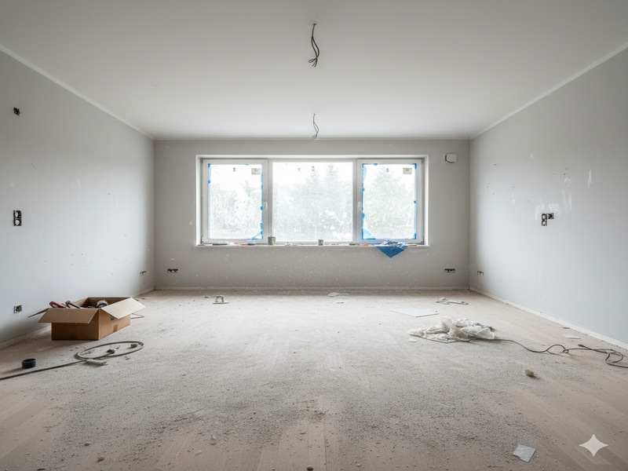
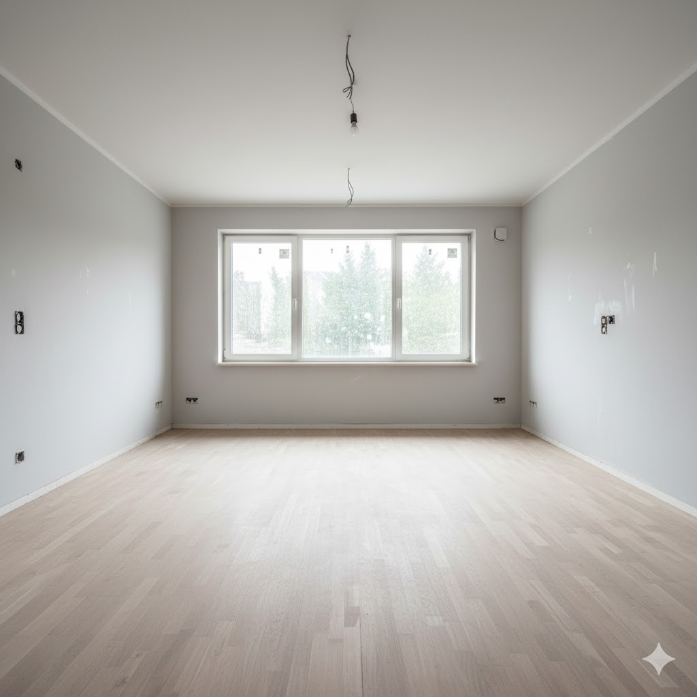

# 📸 Anleitung: Vorher-Nachher Bilder Hinzufügen

## Wo werden die Bilder in der Website angezeigt?

Die Vorher-Nachher Bilder werden in der **Galerie-Sektion** angezeigt (Referenzen-Bereich).

## 🎯 Schritt-für-Schritt Anleitung

### Option 1: Bilder als Hintergrundbilder einfügen (Empfohlen)

1. **Bilder vorbereiten:**
   - Bereite deine Vorher- und Nachher-Bilder vor
   - Empfohlene Größe: Mindestens 800x600 Pixel
   - Format: JPG oder PNG

2. **Bilder hochladen:**
   - Lade die Bilder in denselben Ordner wie `index.html` hoch
   - Benenne sie sinnvoll, z.B.:
     - `buero-vorher.jpg` und `buero-nachher.jpg`
     - `bau-vorher.jpg` und `bau-nachher.jpg`
     - `fenster-vorher.jpg` und `fenster-nachher.jpg`

3. **Code in `index.html` anpassen:**

Suche in der `index.html` nach diesem Abschnitt (ca. Zeile 1734):

```html
<div class="gallery-comparison">
    <div class="gallery-before">
        <div class="gallery-badge">VORHER</div>
        <div class="gallery-icon"><i class="fas fa-building"></i></div>
        <div class="gallery-label">Büro-Reinigung</div>
    </div>
    <div class="gallery-after">
        <div class="gallery-badge">NACHHER</div>
        <div class="gallery-icon"><i class="fas fa-building"></i></div>
        <div class="gallery-label">Büro-Reinigung</div>
    </div>
</div>
```

4. **Füge das `style` Attribut hinzu:**

Ändere den Code zu:

```html
<div class="gallery-comparison">
    <div class="gallery-before" style="background: linear-gradient(rgba(0,0,0,0.3), rgba(0,0,0,0.3)), url('buero-vorher.jpg') center/cover;">
        <div class="gallery-badge">VORHER</div>
        <div class="gallery-icon"><i class="fas fa-building"></i></div>
        <div class="gallery-label">Büro-Reinigung</div>
    </div>
    <div class="gallery-after" style="background: linear-gradient(rgba(0,102,204,0.2), rgba(0,102,204,0.2)), url('buero-nachher.jpg') center/cover;">
        <div class="gallery-badge">NACHHER</div>
        <div class="gallery-icon"><i class="fas fa-building"></i></div>
        <div class="gallery-label">Büro-Reinigung</div>
    </div>
</div>
```

### Option 2: Bilder mit `` Tag einfügen

Alternativ kannst du auch `` Tags verwenden:

```html
<div class="gallery-comparison">
    <div class="gallery-before" style="position: relative;">
        
        <div class="gallery-badge" style="position: relative; z-index: 2;">VORHER</div>
        <div class="gallery-icon" style="position: relative; z-index: 2;"><i class="fas fa-building"></i></div>
        <div class="gallery-label" style="position: relative; z-index: 2;">Büro-Reinigung</div>
    </div>
    <div class="gallery-after" style="position: relative;">
        
        <div class="gallery-badge" style="position: relative; z-index: 2;">NACHHER</div>
        <div class="gallery-icon" style="position: relative; z-index: 2;"><i class="fas fa-building"></i></div>
        <div class="gallery-label" style="position: relative; z-index: 2;">Büro-Reinigung</div>
    </div>
</div>
```

## 📍 Stelle im Code finden

Die Gallery-Sektion findest du in der `index.html`:
- **Zeilennummer:** Ca. 1725-1775
- **HTML ID:** `<section id="gallery" class="gallery">`
- **Suche nach:** `<!-- ===== GALLERY SECTION =====`

## 🎨 Weitere Anpassungen

### Mehr Galerien hinzufügen

Um weitere Vorher-Nachher-Vergleiche hinzuzufügen, kopiere einfach einen `<div class="gallery-comparison">` Block und füge ihn in die `<div class="gallery-grid">` ein:

```html
<div class="gallery-grid">
    <!-- Bestehende Galerien -->
    
    <!-- NEUE Galerie -->
    <div class="gallery-comparison">
        <div class="gallery-before" style="background: linear-gradient(rgba(0,0,0,0.3), rgba(0,0,0,0.3)), url('DEIN-BILD-VORHER.jpg') center/cover;">
            <div class="gallery-badge">VORHER</div>
            <div class="gallery-icon"><i class="fas fa-home"></i></div>
            <div class="gallery-label">Deine Beschreibung</div>
        </div>
        <div class="gallery-after" style="background: linear-gradient(rgba(0,102,204,0.2), rgba(0,102,204,0.2)), url('DEIN-BILD-NACHHER.jpg') center/cover;">
            <div class="gallery-badge">NACHHER</div>
            <div class="gallery-icon"><i class="fas fa-home"></i></div>
            <div class="gallery-label">Deine Beschreibung</div>
        </div>
    </div>
</div>
```

### Icons ändern

Du kannst die Icons ändern, indem du die FontAwesome Klassen anpasst:
- Büro: `<i class="fas fa-building"></i>`
- Baustelle: `<i class="fas fa-tools"></i>`
- Fenster: `<i class="fas fa-window-restore"></i>`
- Haus: `<i class="fas fa-home"></i>`
- Industrie: `<i class="fas fa-industry"></i>`
- Krankenhaus: `<i class="fas fa-hospital"></i>`

Weitere Icons findest du auf: https://fontawesome.com/icons

## 💡 Tipps für beste Ergebnisse

1. **Bildqualität:** Nutze hochauflösende Bilder (min. 800x600px)
2. **Dateigröße:** Komprimiere die Bilder vorher (max. 500KB pro Bild)
3. **Format:** JPG für Fotos, PNG für Grafiken
4. **Konsistenz:** Nutze ähnliche Perspektiven für Vorher/Nachher
5. **Beleuchtung:** Achte auf gute Beleuchtung in beiden Bildern

## 🔧 Troubleshooting

**Problem:** Bilder werden nicht angezeigt
- ✅ Überprüfe den Dateinamen (Groß-/Kleinschreibung beachten!)
- ✅ Stelle sicher, dass die Bilder im richtigen Ordner sind
- ✅ Prüfe den Pfad im `url()` Attribut

**Problem:** Bilder sind zu dunkel/hell
- ✅ Passe die `rgba` Werte im `linear-gradient` an
- ✅ Für hellere Bilder: Reduziere den Alpha-Wert (z.B. von 0.3 auf 0.1)
- ✅ Für dunklere Bilder: Erhöhe den Alpha-Wert (z.B. von 0.3 auf 0.5)

## 📧 Support

Bei Fragen oder Problemen:
- E-Mail: info@kristallrein-kassel.de
- Telefon: +49 1515 1816181
